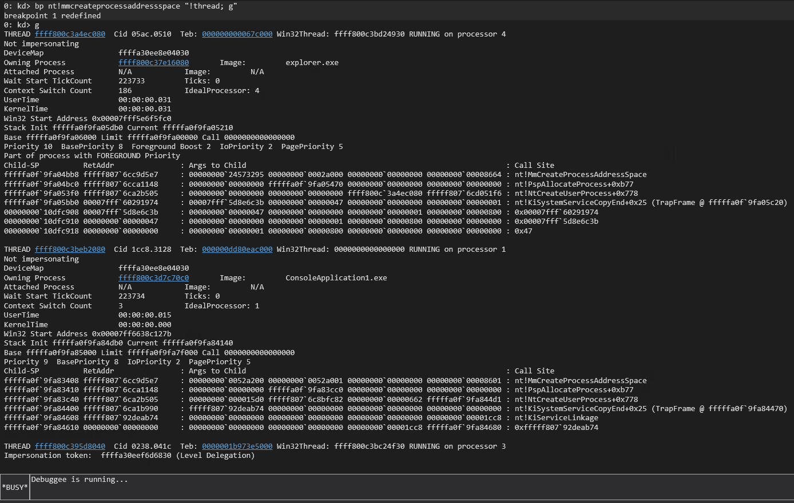

# future
I need to understand how the process is started in windows 11.


# break on MmcreateProcessAddressSpace
bp nt!MmcreateProcessAddressSpace

```
bp condrv!CdpFastIoDeviceControl ".echo \"condrv!CdpFastIoDeviceControl \";db esp L10; g"

# bp on a process from processhacker (mimikatz this case, to debug )
bp /p 0x7ff6feb30000 condrv!CdpFastIoDeviceControl ".echo \"condrv!CdpFastIoDeviceControl \";db esp L10; g"
```

## debug output from the video:
```windbg
nt!MmCreateProcessAddressSpace (FPO: [2,23,4])
nt!PspAllocateProcess+0x4ab (FPO: [Non-Fpo])
nt!NtCreateUserProcess+0x446 (FPO: [Non-Fpo])
nt!KiSystemServicePostCall (FPO: [0,3] TrapFrame @ 9ca67a5c)
nt!ZwCreateUserProcess+0x11 (FPO: [11,0,0])
condrv!CdpCreateProcess+0xc0 (FPO: [Non-Fpo])
```

# debug output from windows 11:
```windbg
6: kd> !thread
THREAD ffffd3093e97a080  Cid 30cc.3168  Teb: 000000ef0d670000 Win32Thread: ffffd309419bad30 RUNNING on processor 6
Not impersonating
DeviceMap                 ffffb4077f617720
Owning Process            ffffd30936f5e080       Image:         powershell.exe
Attached Process          N/A            Image:         N/A
Wait Start TickCount      10449061       Ticks: 1 (0:00:00:00.015)
Context Switch Count      11946          IdealProcessor: 6             
UserTime                  00:00:06.031
KernelTime                00:00:01.890
Win32 Start Address 0x00007ff93da05860
Stack Init ffff8185b911edb0 Current ffff8185b911e180
Base ffff8185b911f000 Limit ffff8185b9119000 Call 0000000000000000
Priority 8  BasePriority 8  IoPriority 2  PagePriority 5
Child-SP          RetAddr               : Args to Child                                                           : Call Site
ffff8185`b911dbb8 fffff802`2d29d5e7     : 00000000`1a134682 00000000`0002a000 00000000`00000000 00000000`00008664 : nt!MmCreateProcessAddressSpace
ffff8185`b911dbc0 fffff802`2d2a1148     : 00000000`00000000 ffff8185`b911e470 00000000`00000000 00000000`00000000 : nt!PspAllocateProcess+0xb77
ffff8185`b911e3f0 fffff802`2d02b505     : 00000000`00000000 00000000`00000000 ffffd309`3e97a080 fffff802`2d3051f6 : nt!NtCreateUserProcess+0x778
ffff8185`b911ebb0 00007ff9`7ecb1974     : 00007ff9`7c3e6c3b 0000021f`00000047 00000000`00000000 00000000`00000001 : nt!KiSystemServiceCopyEnd+0x25 (TrapFrame @ ffff8185`b911ec20)
000000ef`0ed4c4b8 00007ff9`7c3e6c3b     : 0000021f`00000047 00000000`00000000 00000000`00000001 00000000`00000001 : 0x00007ff9`7ecb1974
000000ef`0ed4c4c0 0000021f`00000047     : 00000000`00000000 00000000`00000001 00000000`00000001 00000000`00000000 : 0x00007ff9`7c3e6c3b
000000ef`0ed4c4c8 00000000`00000000     : 00000000`00000001 00000000`00000001 00000000`00000000 00000000`00000000 : 0x0000021f`00000047
```


# break on condrv

```wsd
bc *
bp condrv!CdpFastIoDeviceControl ".echo \"bp 0\";!process;!thread; bd 0; g"
bp nt!MmCreateProcessAddressSpace "bd 1;.echo \"bp 1\";!thread;g"
```


# usefull other commands:
## list the information of the thread of the current process (of helloworld.exe):
!tread
## list all active process:
!process 0 0

## list the thread when starting helloworld





