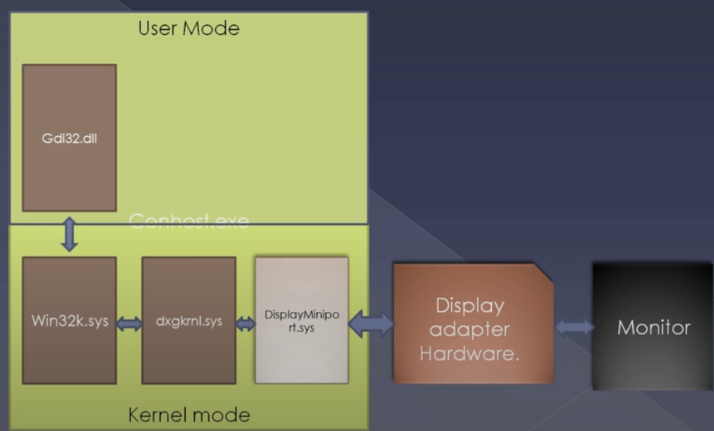

# Summary

* Importance of learning internals of a
modern operating system.
* How complicated apparently simple
looking things can be.
* Whether to be in world of abstraction of reality or to be in world of actual reality?
* What are the gains for all the hard work?

# Agenda

* Not to explain or teach things.
* To show how complicated apparently simple looking stuffs in a modern OS like Windows.

Note

* If you are new to windows operating system intemols you are going to see a lot of things without much of an infroduction.

* In many cases understanding our ignorance is the trigger which we need for earning.

# Do you really know the working of a hello world application in any programming language (java, C#, C++ ...)

# Demo ( everything is windows 8.1 (8) specific — not before or after)

1. Executing a hello world.
2. Observing the presence of conhost in process explorer.
3. Who wrote code for black window? System?
4. conhost created by `helloworld.exe` where is code for that?.
5. Conhost is started by `helloworld.exe` even before a usermode debugger started.
6. So we need a much earlier break in the run of creating the process for `helloworld.exe`
7. bp on nt!MmCreateProcessAddressSpace in kd.
8. Starting hello world again.
9. Looking at the stack with create conhost.
10. bp /p <helloworldEProcess> condrv!CdpFastloDeviceConftrol
11. See printf and getch calls.
12. Looking at the threads inside conhost.

# You already lost?

* Unfortunately things have just started from a printf working stand point.
* So far just tip of the iceberg in the journey of printf.

# Long Story Short

What conhost does on getting command from condrv?

## This illustrations shows how the userland program shows the cmd prompt to the user to the monitor.

### Win32k.sys (request to )

Asks `dxgkrnl.sys` to draw the cmd pane

## dxgkrnl.sys  (pixel level)
ask the DisplayMiniport.sys will interact with the hardware, the hardware in the display will draw the newly allocated buffer to the monitor.

## I'm working with java I don't care about these stuffs.

* You cannot be more incorrect. (more incorrect is incorrect? 😃 )
* A novelist cannot write a great novelin a language say French without knowing the culture, social, economic ( and more ) background of the French society, irrespective of the fact that how good he is in French language.
* This is a similar case.
* Any programming language does is “programs” the system one way or the other.

# How deep the rabbit hole goes?

> Unfortunately, no one can be told what the Matrix is, you have to see it for yourself. This is your last chance. After this, there is no turning back. If you take the blue pill, the story ends, you wake up in your bed and believe whatever you want to believe. If you take the red pill, you stay in Wonderland, and I show you how deep the rabbit hole goes. Remember, all I am offering is the truth, nothing more.
> 
> Morpheus — courtesy “The Matrix”

### bluepill
Of course you can get away with abstractions without the knowledge in depth.

### redpill
you can do more effecively if you know the system internals

# What you will gaine

A programming language independent knowledge of a modern operafing system.

A greater inside and better leverage towards using, administrating, testing, troubleshooting, programming, architecting, protecting the operating system. 

You will hardly worry about
- A new programming language
- A new operating system release
- A new unknown software running on it.

Once you know the working of the OS.

You will start better appreciating the advantages of new computing approaches... say - how hadoop/mapreduce can help over ntfs/sgl in some cases?

# About the coming series...

* Understanding the principles of a modern OS.
* Apply on windows. (we'll be using 8.1 for most of our exercises)
* See the programming interfaces, algorithms and data structures.
