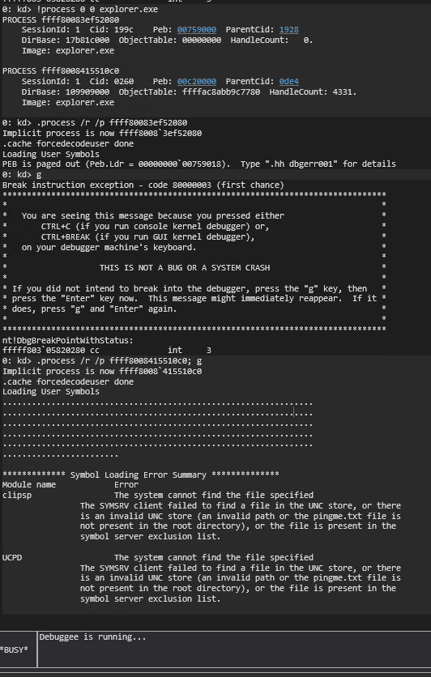
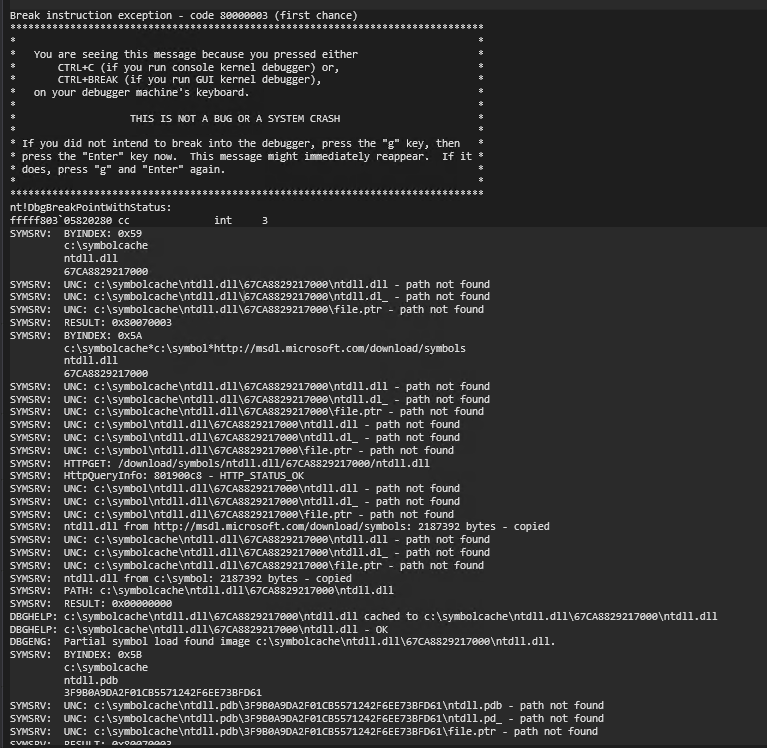
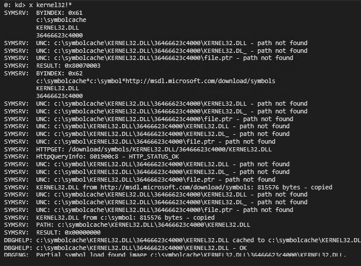
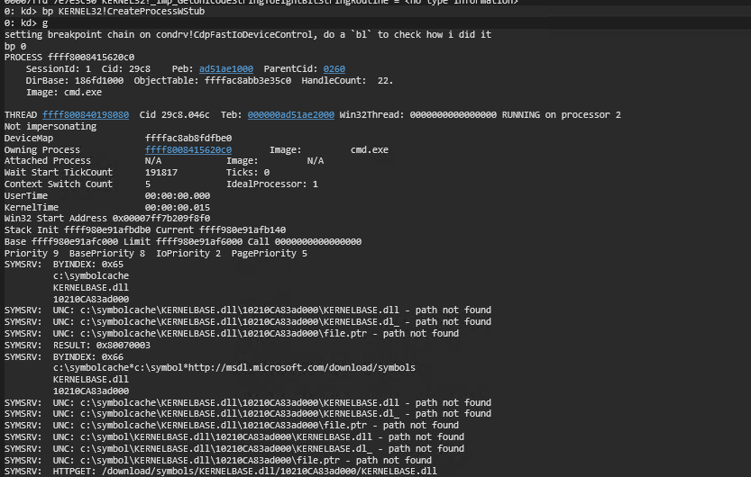

To load the correct symbols, ensure you execute the `.reload /f` command.
With that done, we can set a breakpoint as we did in Part-03, as shown in the video/transcript:

```
.process /r /p ffff8008415510c0; g
(hit bp), and do the:
.reload /f
```

Now we are on the same (memory) page




This command will load the symbols:



Next, we can verify if the symbols have been correctly loaded:



In my case, the symbols have been successfully loaded.
Now, let's set a breakpoint on `bp KERNEL32!CreateProcessWStub` and repeat the steps from Part-03:



As you can see, I launched `cmd.exe` from within the URL bar of Explorer, and my breakpoints were hit successfully.

