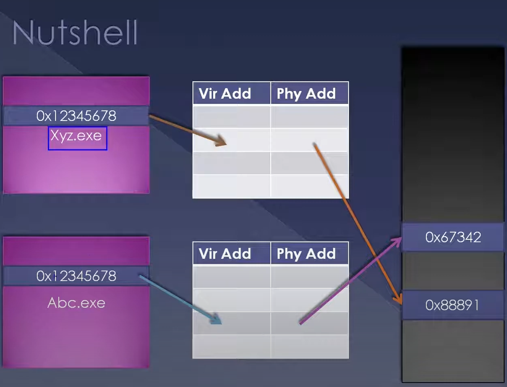

In the previous presentations, we have seen what a process is, how to create it, etc. In this presentation, we're going to look at a more in-depth understanding of processes.

## Introduction

We have seen that processes are used for isolation. Different programs need isolated memory regions inside the operating system. Think about a scenario in which you can keep two different objects on a shelf in the exact same place at the exact same time. As we're going to see in this presentation, that is exactly what a process does and why we need to create different universes for different processes. This is what we mean by different processes' virtual address space. 

If a process A stores a value at a specific address, process B can store a value at the same address at the same time. In the case of process A, the address points to a different physical location than the same address in the case of process B. Also, process A has no understanding of the existence of process B, nor can it access or modify the value at the address used by process B, and vice versa. This isolation is achieved by mapping the same virtual address to different physical addresses with the help of page table entries.

## Memory Management Overview

There is a detailed presentation from myself regarding memory management where we explain every bit of this mechanism, including the role of the processor. I'm not going to explain the entire thing here, but let's summarize:

Two different processes, `XYZ.exe` and `ABC.exe`, are running on Windows on the same computer. Both these processes have an address `0x12345678`. The code or the DLL or the EXE running inside this particular address space can read, write, or execute from this address. The CPU translates this virtual address to a physical address inside the RAM using the page table.

### Example

Consider the following:
- `XYZ.exe` has a virtual address `0x12345678` pointing to a specific physical address.
- `ABC.exe` has the same virtual address `0x12345678` pointing to a different physical address in the RAM.

The page table entries (PTEs) for each process are different. Each row in the page table points to a physical address for a given virtual address.

## Practical Demonstration

Let's look at the debugger:
- Using KD attached to a virtual machine running Windows 8.1.
- The command `!process 0 0` shows all the processes running in the system.
- Select a random process and switch into that process context using `.process /r /p <process_pointer>`.
- Take a user-mode address within this process and display its value.
- Switch to a different process context and execute the same command. The value will differ, demonstrating that the same address in different process spaces has different values.

## Summary

The most important aspect of processes is sandboxing or isolating one application from another with the concept of virtual address space.

## Feedback

I would like to receive reviews, comments, and suggestions from one single location. It is not very useful if you update the YouTube comments, as YouTube is just one way we publish content. If you need more personal attention or have in-depth doubts or require more training, please follow the links provided. Also, refer someone who might benefit from similar findings. This content is available online as well as in direct classroom training.

Thank you for watching. See you next time!

- Generated with [Kome.ai](https://kome.ai)
