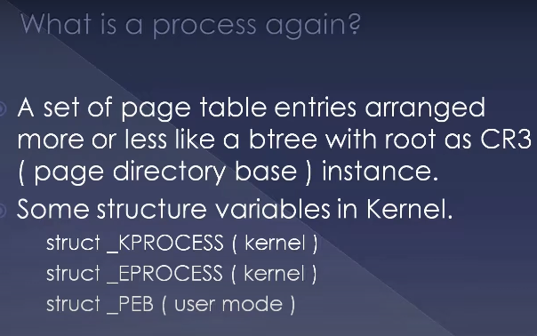
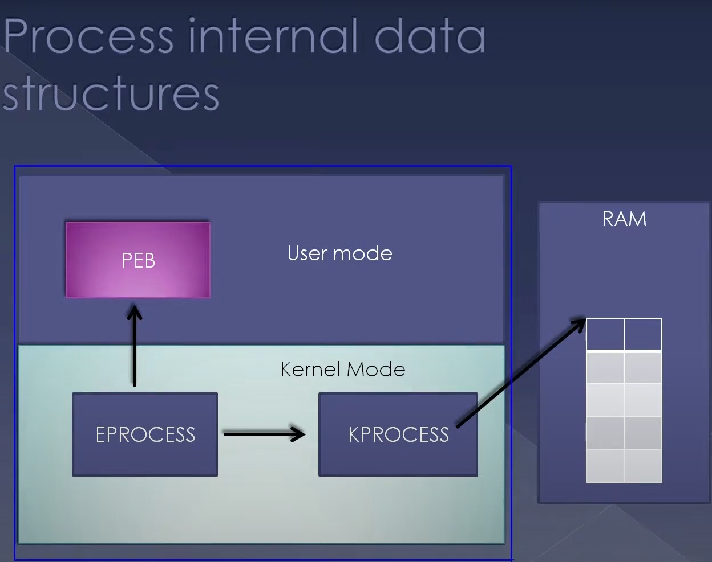

# Introduction

In this presentation, we're going to look at metadata structures of a process in Windows.

## Data Structures

As a matter of fact, everything you see in an operating system is a data structure. For example, the window in which you see this particular presentation, the process which hosts it, and the thread that runs it, all are pieces of memory in well-defined kernel data structures.

Here, we're going to look at some of the data structures of a process in Windows. Since I mentioned earlier, a process is a set of page table entries arranged more or less like a B-tree with a root as CR3 (page directory base). The page table entries are one of the most important components of a process and reside in physical memory. We won't be looking at that in this particular presentation. Other presentations explain the page table entries in CR3 in detail.

## Kernel Data Structures

We will look at some of the kernel data structures like `_KPROCESS`, `_EPROCESS`, and `_PEB`. These are the variables in the kernel related to a process used for bookkeeping.

### KPROCESS and EPROCESS

`_KPROCESS` is a field inside a process and is the first element in the process structure. This means that if you have a pointer to `_EPROCESS`, it will also point to `_KPROCESS`. 

Although logically treated as different entities, in the kernel, there is only one structure, `_EPROCESS`, which contains `_KPROCESS`. In user mode, we have the `PEB`.

### User Mode and Kernel Mode

The entire process virtual address space is divided into two parts: the lower 2GB (user mode) and the upper 2GB (kernel mode).

- **User Mode:** Contains the `_PEB` structure.
- **Kernel Mode:** Contains `_EPROCESS` and `_KPROCESS`.

`_KPROCESS` is more machine-dependent, for example, `CR3`, a feature of the x86 architecture. `PEB` is a Windows-specific artifact with a direct pointer from `_EPROCESS` to `PEB`.

### Page Table Entries

The process has the base address of the page table entry or the root of the tree, which is the `CR3` instance pointing to the RAM. This address is a physical address pointing to the RAM, so the page table entries are inside the physical memory. Virtually everything related to a process can be accessed from its `_EPROCESS` structure.

### Linked List of processes

The `_EPROCESS` structure is the root of all process-related data. There is a linked list linking all the `_EPROCESS` structures of all the processes running on an operating system. The head of this list is `PsActiveProcessHead`, a kernel global variable.

## Demonstration

We will see a demo using a kernel debugger attached to a virtual machine running Windows 8.1.

1. Execute the command `!process 0 0` to see all the processes running in the system.
2. Get the offset of the list entry inside the `_EPROCESS` structure using the command `dt nt!_EPROCESS`.
3. Walk the linked list to dump out all the processes running in the system using the command `dd PsActiveProcessHead`.

### Key Structures

- **KPROCESS:** A smaller structure compared to `_EPROCESS`, containing machine-dependent fields like `CR3`.
- **EPROCESS:** Contains bookkeeping data structures.
- **PEB:** The user-mode data structure containing information like the heap, loaded DLLs, etc.

## Create Process

The `CreateProcess` function involves creating these data structures. It sets up the page table entries, maps the binary to the address space, and creates the primary thread. Every process has at least one thread to execute instructions inside the mapped binary.

## Summary

We have seen `_KPROCESS`, `_EPROCESS`, and `PEB`, which are important data structures in both kernel mode and user mode. Creating, accessing, modifying, or deleting a process involves manipulating these data structures.

## Outro

That's about the presentation. I would like to receive reviews, comments, and suggestions from one single location. Updating YouTube comments is not useful to me as YouTube is just one way we publish content. If you need more personal attention or have in-depth doubts, please follow the provided links. Also, refer someone who might benefit from similar training. This content is available online as well as in direct classroom training.

Thank you for watching. See you next time!
