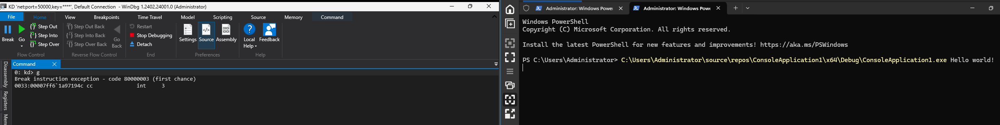
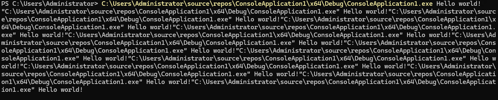

# Following along


## check the code

I've rewritten the code instead of using the `__asm` function i'm using the __debugbreak() function.

```cpp
#include <iostream>
#include <Windows.h>
#include <conio.h>

int main()
{
    __debugbreak();
    while (1)
    {
        LPTSTR test = GetCommandLine();
        printf("%S", test);
        _getch();
    }
    return 0;
}
```

## breaking the code 

Left is my kernel debugging session and is waiting to continue, on the right is the debugger triggered.


## continue the execution (`g`):

The stdout will look like this (after hitting a few times on any key, i've not used enter):



