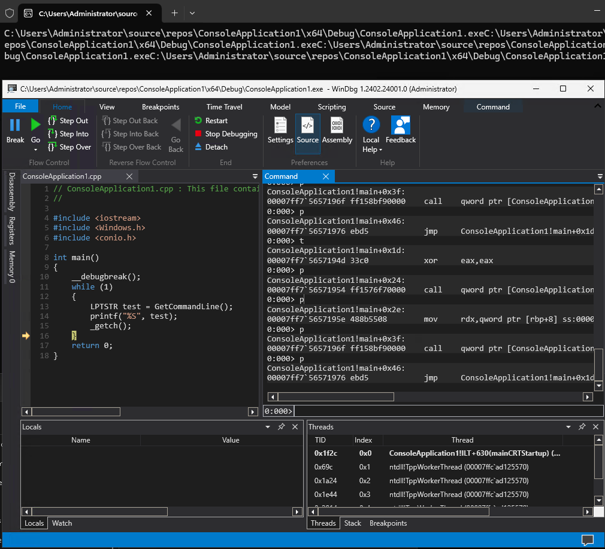
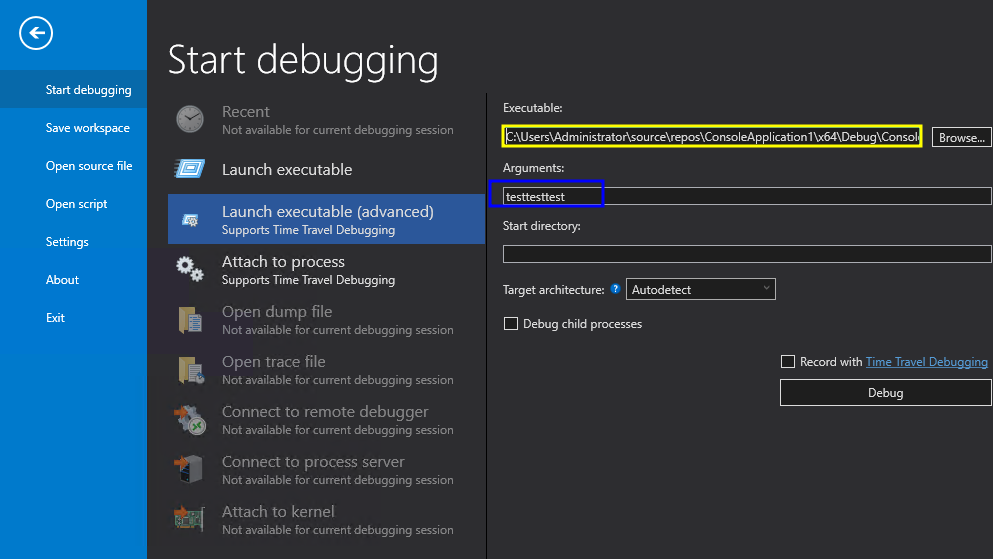
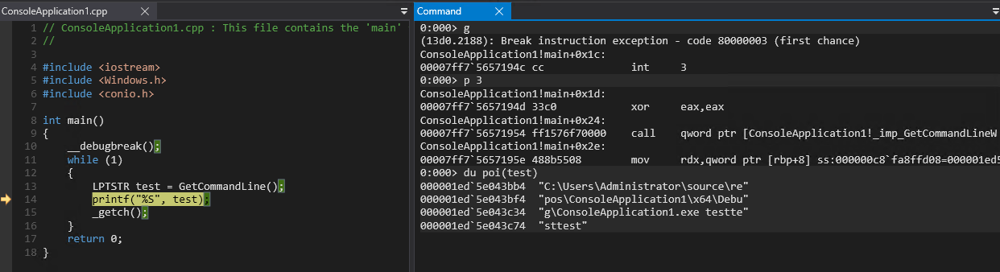

# Following along


## check the code

I've rewritten the code instead of using the `__asm` function i'm using the __debugbreak() function.

```cpp
#include <iostream>
#include <Windows.h>
#include <conio.h>

int main()
{
    __debugbreak();
    while (1)
    {
        LPTSTR test = GetCommandLine();
        printf("%S", test);
        _getch();
    }
    return 0;
}
```

## breaking the code 

Left is my kernel debugging session and is waiting to continue, on the right is the debugger triggered.


## continue the execution (`g`):

The stdout will look like this (after hitting a few times on any key, i've not used enter):


## Userland debugging:

In userland debugging the symbols will be loaded from the binary and we get something like this:




To edit the args, like done in the video, do this as highlighted in yellow, the path (inc bin) to the binary, in blue the arguments :



Now the usual `p` `pt` `g`... 

For example, check what the output is from the variable after executing the GetCommandLine(); for the first time:



In the !peb / !teb 

## alternative ways to dump the dll files:


```wds
dt -r ntdll!_TEB @$teb

$$ list the peb:
dt -r ntdll!_PEB poi(@$teb+0x60)

$$ 
dt -r ntdll!_PEB_LDR_DATA poi(poi(@$teb+0x60)+0x18)


dt -r ntdll!_PEB @$peb
$$ list the peb from referenced teb
dt -r ntdll!_PEB poi(@$teb) + 0x60 $$ this one doesn't work
....


dt -r ntdll!_LIST_ENTRY poi(poi(poi(@$teb+0x60)+0x18)+0x30)
```


1. Get the TEB Address:

```shell
dt -r ntdll!_TEB @$teb
```
 
2. PEB Address from TEB:

```shell
dt -r ntdll!_PEB poi(@$teb+0x60)
```
 
3. PEB_LDR_DATA Address from PEB:

```shell
? poi(poi(@$teb+0x60)+0x18)
```
 
4. **List the InInitializationOrderModuleList from LDR** :

```shell
dt -r ntdll!_LIST_ENTRY poi(poi(poi(@$teb+0x60)+0x18)+0x30)
```
 
5. **Traverse the InInitializationOrderModuleList** :
List the first module:

```shell
dt -r ntdll!_LDR_DATA_TABLE_ENTRY poi(poi(poi(@$peb+0x18)+0x10))
```

List the second module:


```shell
dt -r ntdll!_LDR_DATA_TABLE_ENTRY poi(poi(poi(@$peb+0x18)+0x10))
dt -r ntdll!_LDR_DATA_TABLE_ENTRY 
dt -r ntdll!_LDR_DATA_TABLE_ENTRY poi(poi(poi(poi(poi(@$teb+0x60)+0x18)+0x30)+0x10))
```

List the third module:


```shell
dt -r ntdll!_LDR_DATA_TABLE_ENTRY poi(poi(poi(poi(poi(poi(@$teb+0x60)+0x18)+0x30)+0x10)+0x10))
```